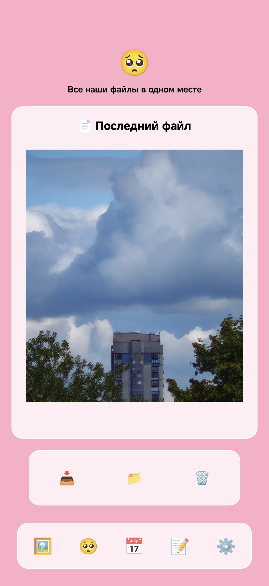
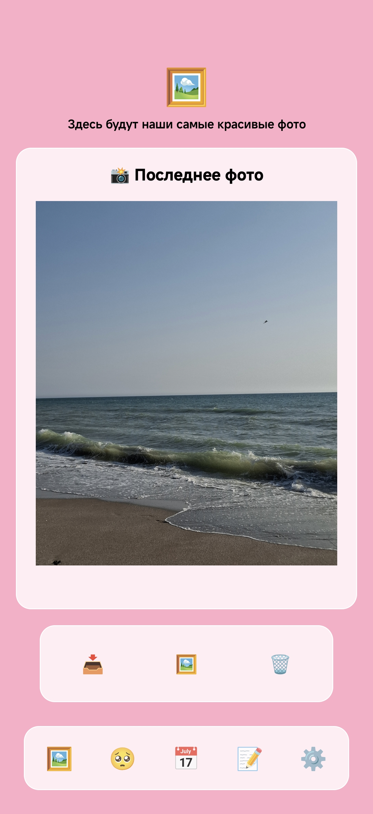
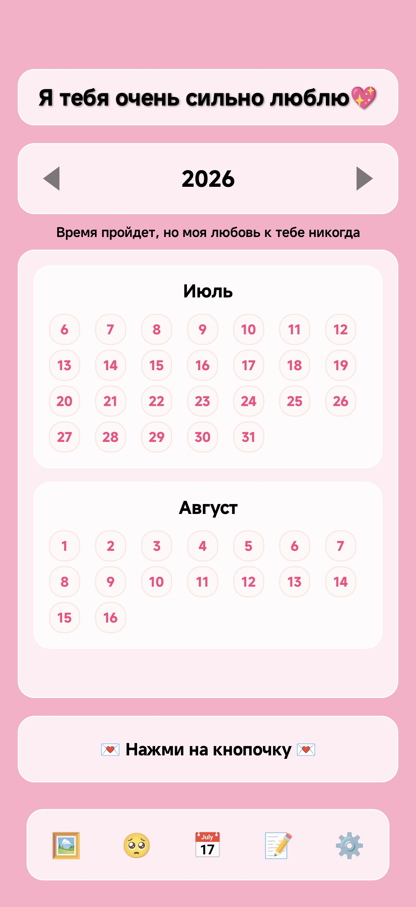
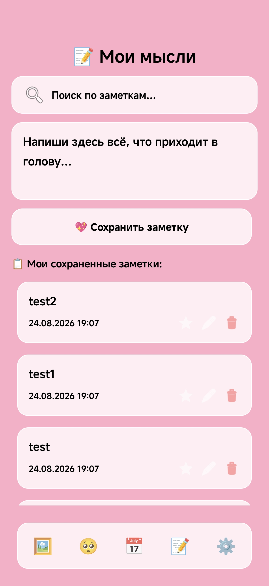
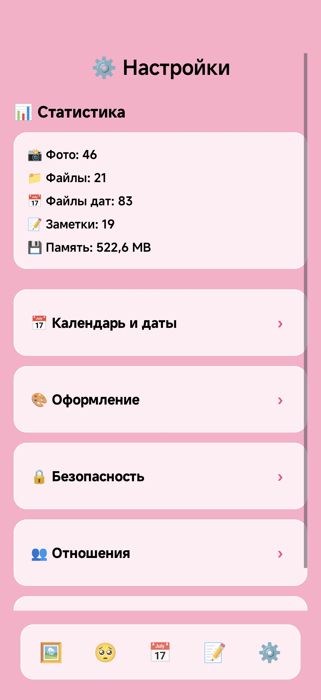

# Lovestor(age)y

[](https://developer.android.com)
[](https://kotlinlang.org)
[](https://github.com/Nurmedovv/Lovestoragey/releases/latest)

> Приложение для сохранения и защиты общих воспоминаний в паре
> An app for preserving and protecting a couple's shared memories

[🇷🇺 Русский](#-русский) · [English](#-english)

<p align="center">
  
  
  
  
  
</p>

## 🇷🇺 Русский

### О проекте

Lovestor(age)y - это Android-приложение, разработанное для пар, которые хотят хранить свои важные моменты в одном защищённом месте. Приложение предоставляет интуитивный интерфейс для загрузки, организации и просмотра фотографий, видео, заметок и документов.

📱 **[Скачать APK](https://github.com/Nurmedovv/Lovestoragey/releases/latest)** и установить на устройство с Android 7.0+

### Функции

#### Основные возможности
- **Галерея** - Загрузка и просмотр фото и видео с автоматическим слайдшоу
- **Календарь** - Просмотр медиа по датам с возможностью привязки к конкретному дню
- **Файлы** - Хранение документов (PDF, аудио, видео)
- **Заметки** - Личные мысли и послания
- **Настройки** - Управление темой, датами, уведомлениями

#### Технические особенности
- Биометрическая аутентификация (отпечаток пальца)
- Шифрованное хранение данных
- Push-уведомления через Firebase Cloud Messaging
- Синхронизация с Firebase Firestore
- Локальное кэширование изображений (Glide)

### Технологический стек

| Категория | Технология |
|-----------|------------|
| **Язык** | Kotlin 2.0 |
| **Android** | minSdk 24, targetSdk 35 (compileSdk 36) |
| **Архитектура** | MVVM + Clean Architecture принципы |
| **UI** | ViewBinding, Material Design |
| **База данных** | Room (SQLite) |
| **Backend** | Firebase (Firestore, Auth, FCM) |
| **Асинхронность** | Kotlin Coroutines + LiveData |
| **Изображения** | Glide |
| **Безопасность** | Biometric API, EncryptedSharedPreferences |

### Структура проекта

```
app/src/main/java/com/lovestory/app/
├── LoveStoryApp.kt           # Application: создаёт DI-контейнер
├── di/
│   └── AppContainer.kt       # ручной DI: репозитории + use case'ы
├── domain/                   # бизнес-логика: без UI и базы данных*
│   ├── model/                # AppFile, FileLocation, FileType, LocationType
│   ├── repository/           # интерфейсы: CoupleRepository, CoupleSessionStore,
│   │                         # FilesRepository, AuthRepository, LockRepository,
│   │                         # BackupRepository
│   └── usecase/              # сценарии пары: CreateCoupleUseCase,
│                             # JoinCoupleByCodeUseCase, UnpairUseCase,
│                             # SendMessageUseCase (лимит 20 символов - здесь)
├── data/                     # реализации репозиториев
│   ├── couple/               # CoupleRepositoryImpl (Firestore), CoupleSessionStoreImpl
│   │                         # (SharedPreferences), CoupleContract (поля документа)
│   ├── files/                # FilesRepositoryImpl (делегирует FileManager)
│   ├── auth/                 # AuthRepositoryImpl (вокруг AuthManager)
│   └── backup/               # ExportManager: ZIP-экспорт/импорт
├── presentation/             # UI-слой (MVVM-lite: LiveData + ViewBinding)
│   ├── main/                 # MainActivity, ViewPagerAdapter, SharedViewModel
│   ├── lock/                 # LockScreenActivity (LAUNCHER, PIN-экран)
│   ├── gallery/              # GalleryFragment, GalleryViewModel, полноэкранный просмотр
│   ├── calendar/             # CalendarFragment, CalendarAdapter, CalendarData/Generator,
│   │                         # DateMediaDialogFragment, HolidayHelper
│   ├── notes/                # NotesFragment, NotesAdapter, NotesViewModel
│   ├── files/                # FilesFragment, FilesViewModel, диалог файлов
│   ├── settings/             # SettingsFragment, FontColorDialogFragment
│   ├── couple/               # PairingDialogFragment, MessageDialogFragment
│   ├── notifications/        # LovestoryMessagingService (FCM), ExactTimeNotifier,
│   │                         # TimeAlarmReceiver
│   └── common/               # BaseThemeFragment, BaseFilePageDialogFragment, FileAdapter,
│                             # FileOpener, хелперы тем/стекла/шрифтов, ThemeUtils
├── db/                       # Room: AppDatabase, NoteDao/FileDao, NoteEntity/FileEntity
│                             # (+ схемы в app/schemas/)
├── AuthManager.kt            # Google Sign-In + Firebase Auth (реализация data-слоя)
├── SecurePreferences.kt      # PIN/блокировка (EncryptedSharedPreferences),
│                             # реализует LockRepository
└── FileData.kt               # object FileManager: файловое хранилище,
                              # за ним стоит FilesRepository

* domain свободен от UI, Firestore и Room; зависимости направлены внутрь:
  presentation → domain ← data. Оговорка: часть интерфейсов domain принимает
  android.content.Context в параметрах (прагматичное решение для этого размера проекта),
  а AuthRepository открывает GoogleSignInClient.
```

**Правила слоёв** (проверяются grep-аудитами):
- `FirebaseFirestore.getInstance` - только в `data/`;
- `FileManager.` - только внутри `data/files/` и его реализации;
- UI берёт зависимости через `Context.appContainer` или ViewModel.

### Сборка

#### Требования
- JDK 17+ (AGP с compileSdk 36 не собирается на JDK 11)
- Android SDK 36
- Gradle 8.x

#### Команды

```bash
# Debug сборка
./gradlew assembleDebug

# Release сборка
./gradlew assembleRelease

# Запуск тестов
./gradlew test
```

### Конфигурация

Для работы Firebase необходимо:
1. Создать проект в [Firebase Console](https://console.firebase.google.com/)
2. Добавить Android-приложение
3. Скачать `google-services.json` и поместить в `app/`

### Архитектурные решения

- **Прагматичная Clean Architecture** - три слоя (`presentation` / `domain` / `data`);
  зависимости направлены внутрь, к `domain`. Интерфейсы репозиториев живут в `domain/repository`,
  реализации - в `data/`.
- **Ручной DI** - `LoveStoryApp` создаёт `AppContainer`; доступ из фрагмент/сервисов через
  расширение `val Context.appContainer`. Без Hilt/Dagger - проект небольшой, ручного контейнера достаточно.
- **MVVM-lite** - ViewModel + LiveData там, где есть состояние (галерея, файлы, заметки, календарь);
  ViewBinding вместо синтетики; навигация - ViewPager + BottomNavigation.
- **Use case'и по необходимости** - только для сценария пары (`CreateCouple`, `JoinCoupleByCode`,
  `Unpair`, `SendMessage`). Лимит длины послания (20 символов) - единственный источник истины
  в `SendMessageUseCase`.
- **Repository Pattern** - `CoupleRepository` (Firestore), `FilesRepository` (локальное хранилище),
  `AuthRepository`, `LockRepository`, `BackupRepository`. Состояние сессии пары отделено от сети:
  `CoupleSessionStore` (SharedPreferences) vs `CoupleRepository` (Firestore).
- **Стабильная схема БД** - пакет `db/` сознательно не перемещался при рефакторинге,
  чтобы не ломать идентичность Room-схем (`app/schemas/`).
- **Контракты сохранены** - ключи SharedPreferences (`start_year`, `fcm_token`,
  `custom_background_uri`, …) и поля Firestore (`partner1/partner2`, `message_text`,
  `message_sender`, `message_timestamp`, `fcm_tokens`, `names`) не менялись.

### Безопасность

- `allowBackup = false` - отключено резервное копирование
- Biometric/PIN аутентификация
- EncryptedSharedPreferences для токенов
- Локальное хранение данных

---

**Примечание:** Это учебный/портфолийный проект. Для публичного релиза в Google Play требуется доработка (App Signing, Privacy Policy, Play Store Console).

---

## 🇬🇧 English

### About

Lovestor(age)y is an Android app built for couples who want to keep their important moments in one secure place. It offers an intuitive interface for uploading, organizing, and browsing photos, videos, notes, and documents.

📱 **[Download the APK](https://github.com/Nurmedovv/Lovestoragey/releases/latest)** and install it on an Android 7.0+ device

### Features

#### Core features
- **Gallery** - upload and browse photos and videos with automatic slideshow
- **Calendar** - browse media by date and pin items to specific days
- **Files** - document storage (PDF, audio, video)
- **Notes** - personal thoughts and messages
- **Settings** - theme, dates, and notification management

#### Technical highlights
- Biometric authentication (fingerprint)
- Encrypted local storage
- Push notifications via Firebase Cloud Messaging
- Synchronization with Firebase Firestore
- Local image caching (Glide)

### Tech stack

| Category | Technology |
|----------|------------|
| **Language** | Kotlin 2.0 |
| **Android** | minSdk 24, targetSdk 35 (compileSdk 36) |
| **Architecture** | MVVM + Clean Architecture principles |
| **UI** | ViewBinding, Material Design |
| **Database** | Room (SQLite) |
| **Backend** | Firebase (Firestore, Auth, FCM) |
| **Concurrency** | Kotlin Coroutines + LiveData |
| **Images** | Glide |
| **Security** | Biometric API, EncryptedSharedPreferences |

### Project structure

```
app/src/main/java/com/lovestory/app/
├── LoveStoryApp.kt           # Application: creates the DI container
├── di/
│   └── AppContainer.kt       # manual DI: repositories + use cases
├── domain/                   # business logic: no UI, no database*
│   ├── model/                # AppFile, FileLocation, FileType, LocationType
│   ├── repository/           # interfaces: CoupleRepository, CoupleSessionStore,
│   │                         # FilesRepository, AuthRepository, LockRepository,
│   │                         # BackupRepository
│   └── usecase/              # couple scenarios: CreateCoupleUseCase,
│                             # JoinCoupleByCodeUseCase, UnpairUseCase,
│                             # SendMessageUseCase (the 20-char limit lives here)
├── data/                     # repository implementations
│   ├── couple/               # CoupleRepositoryImpl (Firestore), CoupleSessionStoreImpl
│   │                         # (SharedPreferences), CoupleContract (document fields)
│   ├── files/                # FilesRepositoryImpl (delegates to FileManager)
│   ├── auth/                 # AuthRepositoryImpl (wraps AuthManager)
│   └── backup/               # ExportManager: ZIP export/import
├── presentation/             # UI layer (MVVM-lite: LiveData + ViewBinding)
│   ├── main/                 # MainActivity, ViewPagerAdapter, SharedViewModel
│   ├── lock/                 # LockScreenActivity (LAUNCHER, PIN screen)
│   ├── gallery/              # GalleryFragment, GalleryViewModel, fullscreen viewer
│   ├── calendar/             # CalendarFragment, CalendarAdapter, CalendarData/Generator,
│   │                         # DateMediaDialogFragment, HolidayHelper
│   ├── notes/                # NotesFragment, NotesAdapter, NotesViewModel
│   ├── files/                # FilesFragment, FilesViewModel, file dialog
│   ├── settings/             # SettingsFragment, FontColorDialogFragment
│   ├── couple/               # PairingDialogFragment, MessageDialogFragment
│   ├── notifications/        # LovestoryMessagingService (FCM), ExactTimeNotifier,
│   │                         # TimeAlarmReceiver
│   └── common/               # BaseThemeFragment, BaseFilePageDialogFragment, FileAdapter,
│                             # FileOpener, theme/glass/font helpers, ThemeUtils
├── db/                       # Room: AppDatabase, NoteDao/FileDao, NoteEntity/FileEntity
│                             # (+ schemas in app/schemas/)
├── AuthManager.kt            # Google Sign-In + Firebase Auth (data-layer implementation)
├── SecurePreferences.kt      # PIN lock (EncryptedSharedPreferences),
│                             # implements LockRepository
└── FileData.kt               # FileManager object: file storage,
                              # backing FilesRepository

* domain is free of UI, Firestore, and Room; dependencies point inward:
  presentation → domain ← data. Caveat: some domain interfaces take
  android.content.Context parameters (a pragmatic choice for a project this size),
  and AuthRepository exposes a GoogleSignInClient.
```

**Layer rules** (enforced with grep audits):
- `FirebaseFirestore.getInstance` - only inside `data/`;
- `FileManager.` - only within `data/files/` and its implementation;
- the UI obtains dependencies through `Context.appContainer` or ViewModels.

### Build

#### Requirements
- JDK 17+ (AGP with compileSdk 36 does not build on JDK 11)
- Android SDK 36
- Gradle 8.x

#### Commands

```bash
# Debug build
./gradlew assembleDebug

# Release build
./gradlew assembleRelease

# Run tests
./gradlew test
```

### Configuration

To wire up Firebase:
1. Create a project in the [Firebase Console](https://console.firebase.google.com/)
2. Register the Android app
3. Download `google-services.json` and place it in `app/`

### Architecture decisions

- **Pragmatic Clean Architecture** - three layers (`presentation` / `domain` / `data`);
  dependencies point inward, toward `domain`. Repository interfaces live in `domain/repository`,
  implementations in `data/`.
- **Manual DI** - `LoveStoryApp` creates the `AppContainer`; fragments and services reach it
  through the `val Context.appContainer` extension. No Hilt/Dagger - the project is small enough
  that a manual container is sufficient.
- **MVVM-lite** - ViewModel + LiveData wherever state exists (gallery, files, notes, calendar);
  ViewBinding instead of synthetics; navigation via ViewPager + BottomNavigation.
- **Use cases where they pay off** - only for the couple scenario (`CreateCouple`,
  `JoinCoupleByCode`, `Unpair`, `SendMessage`). The 20-character message limit lives in
  `SendMessageUseCase` as the single source of truth.
- **Repository pattern** - `CoupleRepository` (Firestore), `FilesRepository` (local storage),
  `AuthRepository`, `LockRepository`, `BackupRepository`. Couple session state is kept apart
  from the network: `CoupleSessionStore` (SharedPreferences) vs `CoupleRepository` (Firestore).
- **Stable DB schema** - the `db/` package was deliberately not moved during refactoring
  to preserve Room schema identity (`app/schemas/`).
- **Contracts preserved** - SharedPreferences keys (`start_year`, `fcm_token`,
  `custom_background_uri`, …) and Firestore fields (`partner1/partner2`, `message_text`,
  `message_sender`, `message_timestamp`, `fcm_tokens`, `names`) were never renamed.

### Security

- `allowBackup = false` - OS-level backup disabled
- Biometric/PIN authentication
- EncryptedSharedPreferences for tokens
- Local-first data storage

---

**Note:** This is a learning/portfolio project. A public release on Google Play would require additional work (App Signing, Privacy Policy, Play Store Console).
